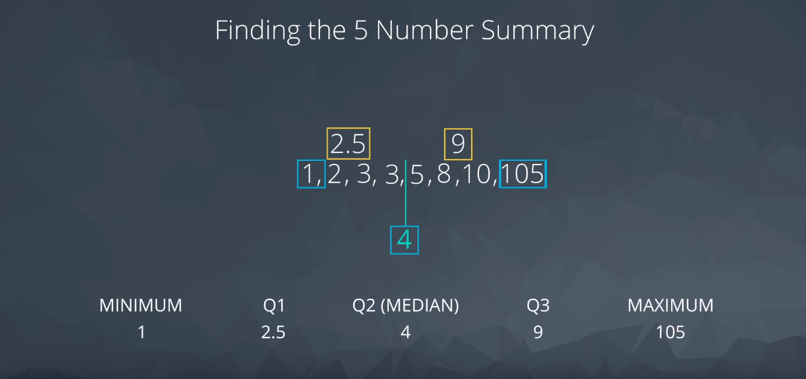
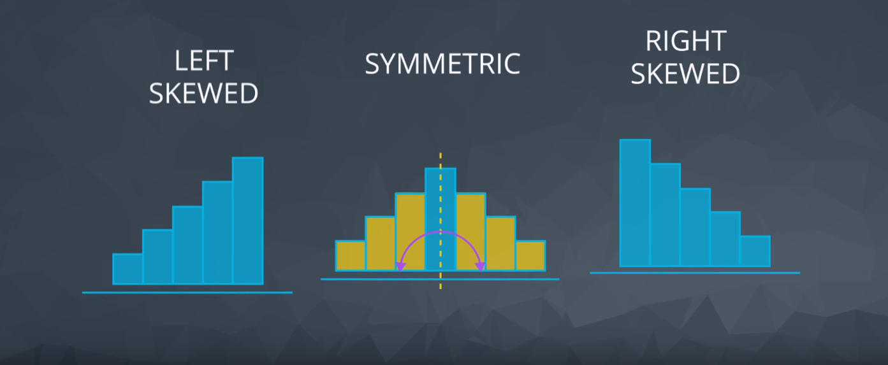
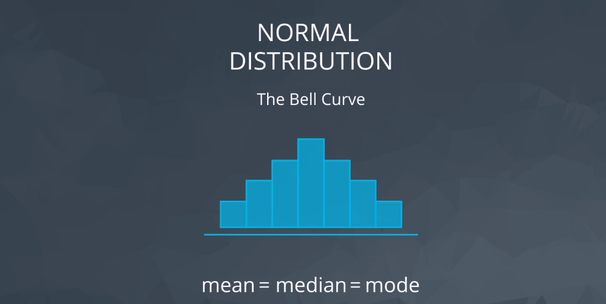
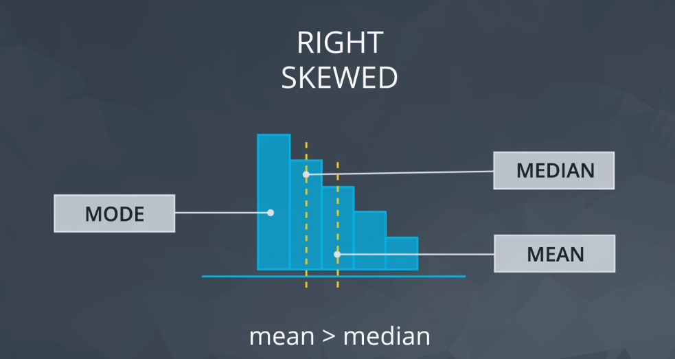
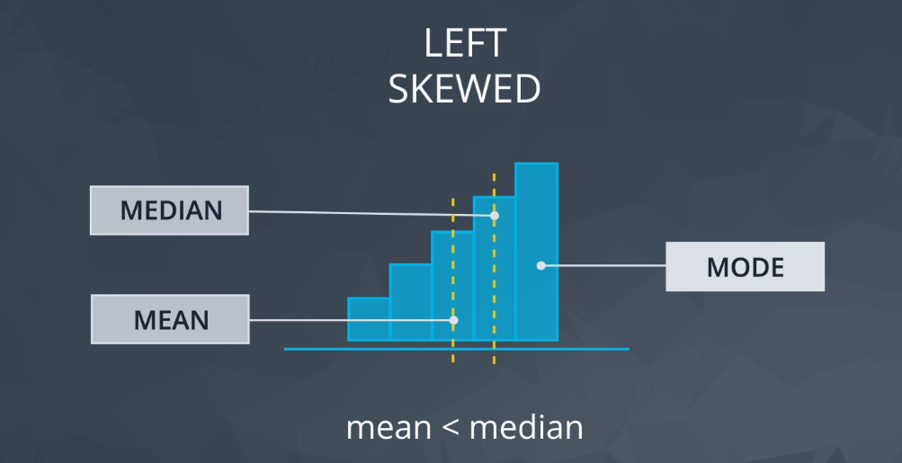

# P4 - 02: [Optional] Descriptive Statistics - Part II

## Aspects of Quantitative Variables
1. Centre
2. Spread
3. Shape
4. Outliers

### 2. Spread
Provide an idea of how spread out the data are from one another.

#### Common Measures of Spread include:
- Range
- Interquartile Range (IQR)
- Standard deviation
- Variance

#### Histogram
The most common visual for Quantitative Data.

#### 5 Number summary
Gives values for calculating the Range and Interquartile range.
1. Minimum: The smallest number in the dataset.
2. Q1: The value such that 25% of the data fall below.
3. Q2: The value such that 50% of the data fall below.
4. Q3: The value such that 75% of the data fall below.
5. Maximum: The largest value in the dataset.

Q1 & Q3: The medians of the data on either side of Q2.

#### Range
The range is then calculated as the difference between the maximum and the minimum.
Calculation: Range = Maximum - Minimum

#### Interquartile Range (IQR)
The interquartile range is calculated as the difference between Q3 & Q1.
Calculation: Q3 - Q1

#### Box Plot
Useful for quickly comparing the spread of two data sets.
- Data varies: if it is broader, the data varies much more than the other
- Range: visualize the box plot distance from start to end
- Interquartile range: distance from the start box to the end box is the

#### Standard Deviation or Variance
Compare the spread of data to determine which is more spread out.
- Standard Deviation: the average distance of each observation from the mean
- Variance: average squared difference of each observation from the mean

Calculation:
- Variance: First you must find the mean. Then the difference between each observation and the mean. Then you square, sum, and divide by the number of observations.
- Standard Deviation: Square Root of Variance

#### Important Final Points
1. The variance is used to compare the spread of two different groups. A set of data with higher variance is more spread out than a dataset with lower variance. Be careful though, there might just be an outlier (or outliers) that is increasing the variance, when most of the data are actually very close.
2. When comparing the spread between two datasets, the units of each must be the same.
3. When data are related to money or the economy, higher variance (or standard deviation) is associated with higher risk.
4. The standard deviation is used more often in practice than the variance, because it shares the units of the original dataset.

Use in the World:
- The standard deviation is associated with risk in finance, assists in determining the significance of drugs in medical studies, and measures the error of our results for predicting anything from the amount of rainfall we can expect tomorrow to your predicted commute time tomorrow.

### 3. Shape
How to use Histograms to determine shape associated with data.
- Left Skewed: shorter bins on the left and taller bins on the right.
- Right Skewed: shorter bins on the right and taller bins on the left.
- Symmetric: can draw a line down the middle and the right side mirrors the left side.

The mode of a distribution is essentially the tallest bar in a histogram. There may be multiple modes depending on the number of peaks in the histogram.

The mean is pulled by the tail of the distribution.

#### Normal Distribution (aka Bell Curve)
Mean = Mediam = Mode
Real World Applications: Height, Weight, Errors, Precipitation

#### Right-skewed Distribution
Real World Applications: Amount of drug remaining in a blood stream, Time between phone calls at a call center, Time until light bulb dies
Mean > Median

#### Left-skewed Distribution
Real World Applications: Grades as a percentage in many universities, Age of death, Asset price changes
Mean < Median

### 4. Outliers
Data points that fall very far from the rest of the values in our dataset. This influences measures like the mean and standard deviation much more than measures associated with the five number summary.

#### How should we work with outliers in practice?
1. Noting they exist and the impact on summary statistics.
2. If typo - remove or fix
3. Understanding why they exist, and the impact on questions we are trying to answer about our data.
4. Reporting the 5 number summary values is often a better indication than measures like the mean and standard deviation when we have outliers.
5. Be careful in reporting. Know how to ask the right questions.

#### Outliers Advice (Instructor advice)
1. Plot your data to identify if you have outliers.
2. Handle outliers accordingly via the methods above.
3. If no outliers and your data follow a normal distribution - use the mean and standard deviation to describe your dataset, and report that the data are normally distributed.
4. If you have skewed data or outliers, use the five number summary to summarize your data and report the outliers.
