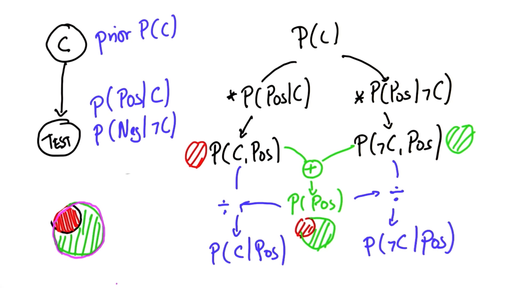

# P4 - 07: Bayes Rule

## Bayes Rule
- Hidden value we care about: C
(whether they have cancer or not)
- Test: Prior P(C)
- Prior of how frequent the variable is distributed:
P(Pos|C) variable is true when positive
P(Pos|not C)

- P(C, Pos) = P(C) x P(Pos|C)
- P(not C, Pos) = P(not C) x P(Pos|C)

- Normaliser: P(C, Pos) + P(not C, Pos)

- P(C, Pos) = P(C, Pos) / Normaliser
- P(not C, Pos) = P(not C, Pos) / Normaliser

